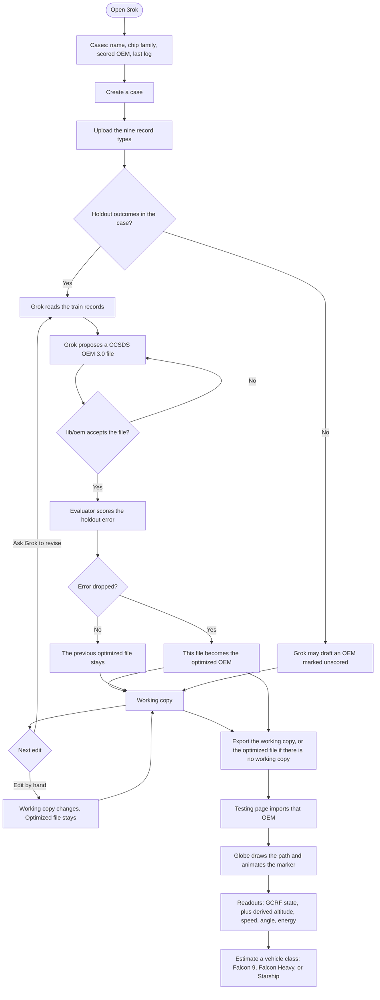
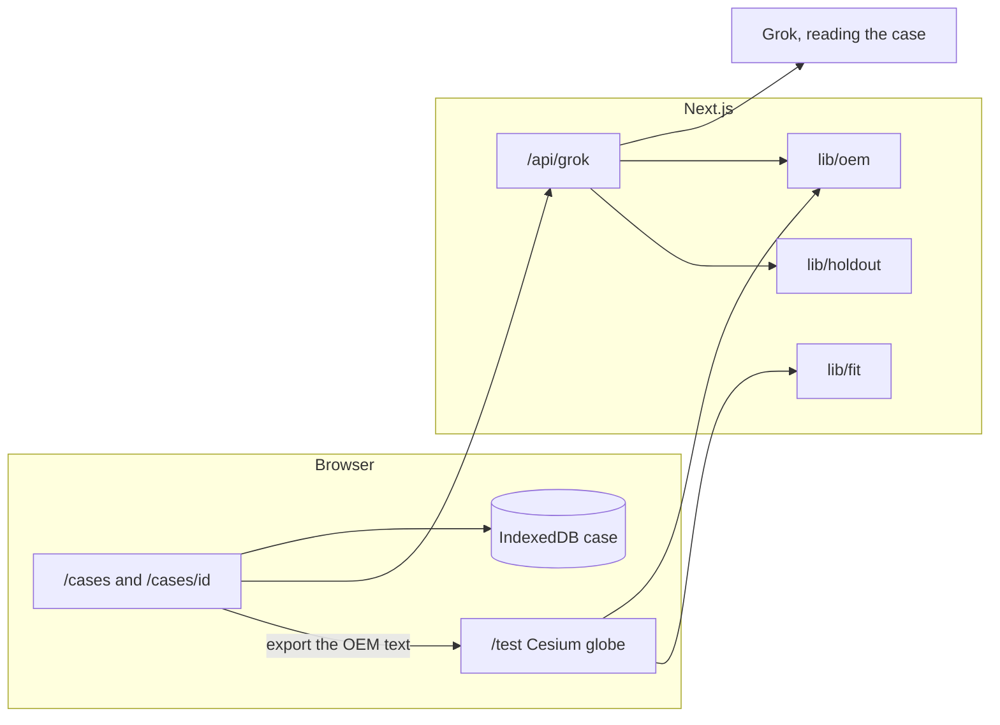
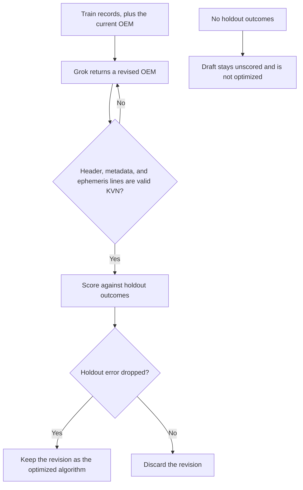

# 3rok — Platform flowchart

3rok takes chip-test data, asks Grok for a flight that keeps those chips alive longer, and flies that path on a globe. The saved container is a case. The flight artifact is a CCSDS OEM file. Grok proposes. A separate evaluator disposes.

This follows [product-spec.md](./product-spec.md). The record types are in [universal-data-input-guidelines.md](./universal-data-input-guidelines.md). The file format is in [flight-algorithm-oem.md](./flight-algorithm-oem.md).

## Case loop

Hand edits and Grok revisions are both log entries. A revision replaces the optimized file only when the holdout error drops. The testing page samples the OEM. It does not ask Grok for the next state.

## Runtime

Cases live in the browser. The Grok route does not own storage. `XAI_API_KEY` stays on the server. Retrieval is per case, so one chip's records do not bleed into another case.

## Evaluator gate

Grok's weights do not change. There is no training run. Holdout rows stay visible to the person and out of the proposal prompt.

## Where the flow lives

| Step | Code | Notes |
|---|---|---|
| Case list and case screen | `/cases`, `/cases/[id]` | Data, activity, algorithm, score |
| Record ingest | Upload mapped to the nine types | Guidelines file is the schema |
| Proposal | `app/api/grok/route.ts` | Reads train records, appends the log |
| Flight file | `lib/oem.ts` | CCSDS OEM 3.0 keyword-value, frame GCRF |
| Keep or discard | `lib/holdout.ts` | Keep only when holdout error drops |
| Globe | `/test` | Client-only CesiumJS, `ssr: false` |
| Vehicle class | `lib/fit.ts` | Published class figures, labeled an estimate |
| Case document | `lib/case.ts` | One contract for every lane |
